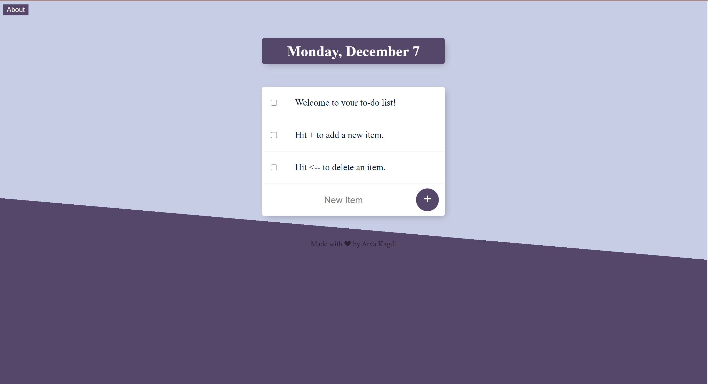

# todolist-v2

Created a todo list website - [todolist](https://pure-ocean-24769.herokuapp.com/)
Includes fucntionality of deleting and adding items. We can also create multiple lists. 

Express.js is used for the back-end, together with MongoDB database software to store data from all the lists. HTML and CSS is used for the front-end

App is deployed using Heroku
mongodb atlas was used to create database cluster

### Cloning and downloading instructions:

Please run npm i from the folder to install node_modules the first time you run the project.

Also in this version I am working on using database for my todo list. For detailed commented version of todo list refer to todolist- v1 repository 

